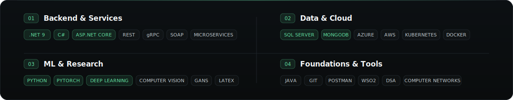
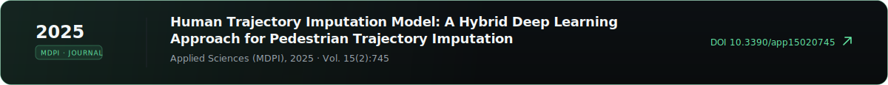
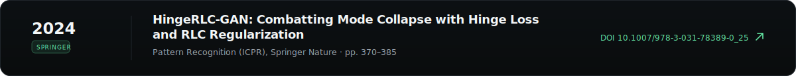
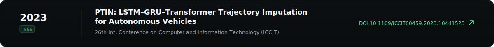
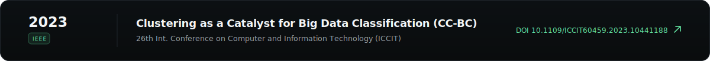

<!-- Hero — hand-designed SVG carrying the portfolio's visual identity (mhalder-dev.github.io) -->
<picture>
  <source media="(prefers-color-scheme: dark)" srcset="./assets/hero.svg" />
  <source media="(prefers-color-scheme: light)" srcset="./assets/hero-light.svg" />
  
</picture>

<samp><a href="https://mhalder-dev.github.io">PORTFOLIO</a>&nbsp;&nbsp;·&nbsp;&nbsp;<a href="https://linkedin.com/in/mhalder007">LINKEDIN</a>&nbsp;&nbsp;·&nbsp;&nbsp;<a href="https://scholar.google.com/citations?user=lJZWnVsAAAAJ&hl=en">GOOGLE&nbsp;SCHOLAR</a>&nbsp;&nbsp;·&nbsp;&nbsp;<a href="mailto:mithunhalder397@gmail.com">EMAIL</a></samp>

 

### <samp>01 — PROFILE</samp>

Backend engineer at **Akij iBOS**, working on the supplier side of **Travilo** — a multi-tenant SaaS flight-booking platform. That means connecting airline and GDS systems such as **Amadeus, Sabre, AirArabia, AirBlue, Tripjack, and Travelport**, each with its own protocol, and folding them behind one clean **.NET** service layer over REST, gRPC, and SOAP.

The other half is research: four peer-reviewed deep-learning papers across MDPI, Springer, and IEEE, a B.Sc. thesis that became a journal article, and a year teaching computer science at United International University. The engineering keeps the research grounded; the research keeps the engineering curious.

 

### <samp>02 — FLAGSHIP</samp>

<picture>
  <source media="(prefers-color-scheme: dark)" srcset="./assets/travilo.svg" />
  <source media="(prefers-color-scheme: light)" srcset="./assets/travilo-light.svg" />
  
</picture>

 
 

### <samp>03 — EXPERIENCE</samp>

<picture>
  <source media="(prefers-color-scheme: dark)" srcset="./assets/experience.svg" />
  <source media="(prefers-color-scheme: light)" srcset="./assets/experience-light.svg" />
  
</picture>

 
 

### <samp>04 — STACK</samp>

<picture>
  <source media="(prefers-color-scheme: dark)" srcset="./assets/stack.svg" />
  <source media="(prefers-color-scheme: light)" srcset="./assets/stack-light.svg" />
  
</picture>

 
 

### <samp>05 — PUBLICATIONS</samp>

<a href="https://doi.org/10.3390/app15020745">
<picture>
  <source media="(prefers-color-scheme: dark)" srcset="./assets/pub-1.svg" />
  <source media="(prefers-color-scheme: light)" srcset="./assets/pub-1-light.svg" />
  
</picture>
</a>
<a href="https://doi.org/10.1007/978-3-031-78389-0_25">
<picture>
  <source media="(prefers-color-scheme: dark)" srcset="./assets/pub-2.svg" />
  <source media="(prefers-color-scheme: light)" srcset="./assets/pub-2-light.svg" />
  
</picture>
</a>
<a href="https://doi.org/10.1109/ICCIT60459.2023.10441523">
<picture>
  <source media="(prefers-color-scheme: dark)" srcset="./assets/pub-3.svg" />
  <source media="(prefers-color-scheme: light)" srcset="./assets/pub-3-light.svg" />
  
</picture>
</a>
<a href="https://doi.org/10.1109/ICCIT60459.2023.10441188">
<picture>
  <source media="(prefers-color-scheme: dark)" srcset="./assets/pub-4.svg" />
  <source media="(prefers-color-scheme: light)" srcset="./assets/pub-4-light.svg" />
  
</picture>
</a>

<samp><a href="https://scholar.google.com/citations?user=lJZWnVsAAAAJ&hl=en">FULL LIST ON GOOGLE SCHOLAR ↗</a></samp>

 

### <samp>06 — CONTACT</samp>

<a href="mailto:mithunhalder397@gmail.com">
<picture>
  <source media="(prefers-color-scheme: dark)" srcset="./assets/contact.svg" />
  <source media="(prefers-color-scheme: light)" srcset="./assets/contact-light.svg" />
  
</picture>
</a>

 
 

<samp>MITHUN HALDER · SOFTWARE ENGINEER @ AKIJ IBOS · DHAKA, BANGLADESH · <a href="https://mhalder-dev.github.io">MHALDER-DEV.GITHUB.IO</a></samp>

