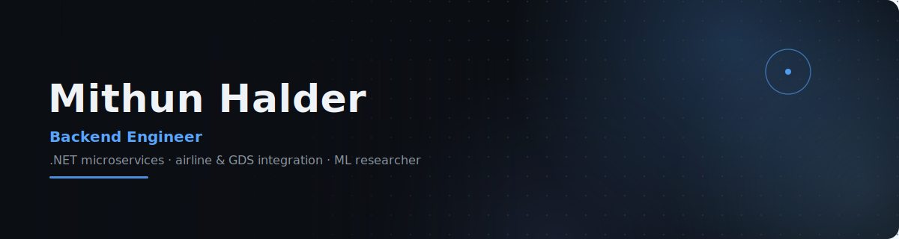
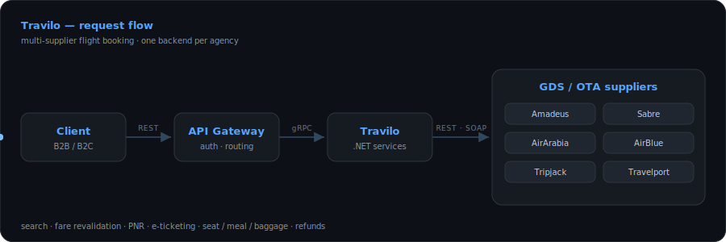



<!-- Custom hand-designed banner (original abstract-minimal composition) -->
<picture>
  <source media="(prefers-color-scheme: dark)" srcset="./assets/banner.svg" />
  <source media="(prefers-color-scheme: light)" srcset="./assets/banner-light.svg" />
  
</picture>

 
 
 

---

> [!NOTE]
> ✈️ **Currently** — lead developer on **Travilo**'s airline &amp; GDS supplier integrations at **Akij iBOS**, connecting `Amadeus`, `Sabre`, `AirArabia`, `AirBlue`, `Tripjack` &amp; `Travelport`.

## 🧭 Profile

Backend engineer at Akij iBOS, working on **.NET** microservices and airline system integration. Responsible for the services behind **Travilo**, a multi-tenant SaaS travel-booking platform that runs several agency brands, each on its own customizable copy of the same backend. Focused on the supplier side, connecting airline and GDS systems such as **Amadeus, Sabre, AirArabia, AirBlue, Tripjack, and Travelport** over `REST`, `gRPC`, and `SOAP`, with additional work on core admin features for partners, reservations, and notifications. Also publishing deep-learning research — four peer-reviewed papers across IEEE, Springer, and MDPI — and formerly a computer science lecturer at UIU.

Open to backend engineering roles, research collaboration, and PhD or lecturer positions — reach out via [email](mailto:mithunhalder397@gmail.com) or [LinkedIn](https://linkedin.com/in/mhalder007).

---

## 💼 Experience

**Software Engineer** · Akij iBOS Ltd. · *Jan 2025 – Present*
- Build and maintain **.NET 9** microservices for Travilo, a multi-tenant SaaS flight-booking platform used by several B2B travel agencies; **lead developer** on the AirArabia, Amadeus, and AirBlue integrations.
- Integrate airline and GDS systems such as Amadeus, Sabre, AirArabia, AirBlue, Tripjack, and Travelport, building the SOAP, REST, and gRPC clients and response mappers for flight search, fare revalidation, PNR creation, e-ticketing, and ancillaries; built the User Management and Reservation systems, including the void, cancel, and refund flow.
- Before Travilo, worked in the R&D team on machine-learning models for theft detection and on flight-API orchestration in WSO2.

**Lecturer (Contractual)** · United International University · *Jun 2024 – Dec 2024*
- Delivered courses in Advanced Object-Oriented Programming, Data Structures & Algorithms, and Computer Networks; contributed to the department's BAETE accreditation process.

---

## 🛠️ Technical Skills

<table>
<tr>
<td><b>Backend &amp; APIs</b></td>
<td>
  
  
  
  
  
  
</td>
</tr>
<tr>
<td><b>Data &amp; Cloud</b></td>
<td>
  
  
  
  
  
  
</td>
</tr>
<tr>
<td><b>Integrations</b></td>
<td>
  
  
  
  
</td>
</tr>
<tr>
<td><b>ML &amp; Research</b></td>
<td>
  
  
  
</td>
</tr>
<tr>
<td><b>Languages &amp; Tools</b></td>
<td>
  
  
  
</td>
</tr>
</table>

---

## 🚀 Selected Project

**✈️ Travilo — Multi-tenant SaaS Travel-Booking Platform**
`.NET 9 · Microservices · REST / gRPC / SOAP · SQL Server · Kubernetes · Azure`

- A B2B/B2C flight-booking platform where each travel-agency brand (such as Jasfare and UthaoTrip) runs its own customizable copy of the same **.NET** backend. Each copy connects several airline and GDS suppliers behind a single set of APIs for search, booking, ticketing, and refunds.
- Lead developer on the **AirArabia, Amadeus, and AirBlue** supplier integrations; also built the partner-management, reservation, and refund systems.

<!-- Custom hand-designed visual — Travilo supplier-integration request flow -->
<picture>
  <source media="(prefers-color-scheme: dark)" srcset="./assets/travilo-pipeline.svg" />
  <source media="(prefers-color-scheme: light)" srcset="./assets/travilo-pipeline-light.svg" />
  
</picture>

---

## 🔬 Research

<table>
<tr>
<td valign="middle" align="center" width="90">
   
  <b>MDPI</b>
</td>
<td valign="middle">
  <b>Human Trajectory Imputation Model: A Hybrid Deep Learning Approach for Pedestrian Trajectory Imputation</b> 
  Applied Sciences · MDPI · &nbsp;<a href="https://doi.org/10.3390/app15020745">doi.org/10.3390/app15020745</a>
</td>
</tr>
<tr>
<td valign="middle" align="center">
   
  <b>Springer</b>
</td>
<td valign="middle">
  <b>HingeRLC-GAN: Combatting Mode Collapse with Hinge Loss and RLC Regularization</b> 
  ICPR · Springer · &nbsp;<a href="https://doi.org/10.1007/978-3-031-78389-0_25">doi.org/10.1007/978-3-031-78389-0_25</a>
</td>
</tr>
<tr>
<td valign="middle" align="center">
   
  <b>IEEE</b>
</td>
<td valign="middle">
  <b>PTIN: LSTM–GRU–Transformer Trajectory Imputation for Autonomous Vehicles</b> 
  ICCIT · IEEE · &nbsp;<a href="https://doi.org/10.1109/ICCIT60459.2023.10441523">doi.org/10.1109/ICCIT60459.2023.10441523</a>
</td>
</tr>
<tr>
<td valign="middle" align="center">
   
  <b>IEEE</b>
</td>
<td valign="middle">
  <b>Clustering as a Catalyst for Big Data Classification (CC-BC)</b> 
  ICCIT · IEEE · &nbsp;<a href="https://doi.org/10.1109/ICCIT60459.2023.10441188">doi.org/10.1109/ICCIT60459.2023.10441188</a>
</td>
</tr>
</table>

---

## 🎓 Education

**B.Sc. in Computer Science & Engineering** · United International University · *2024*
CGPA 3.92 / 4.00 · Thesis: *Hybrid deep learning for pedestrian trajectory imputation*

---

## 📊 GitHub Stats

<picture>
  <source media="(prefers-color-scheme: dark)" srcset="https://streak-stats.demolab.com/?user=mhalder-dev&hide_border=true&background=0D1117&stroke=21262D&ring=58A6FF&fire=58A6FF&currStreakLabel=58A6FF&sideLabels=C9D1D9&currStreakNum=C9D1D9&sideNums=C9D1D9&dates=8B949E&excludeDaysLabel=8B949E" />
  <source media="(prefers-color-scheme: light)" srcset="https://streak-stats.demolab.com/?user=mhalder-dev&hide_border=true&background=FFFFFF&stroke=D0D7DE&ring=0969DA&fire=0969DA&currStreakLabel=0969DA&sideLabels=1F2328&currStreakNum=1F2328&sideNums=1F2328&dates=59636E&excludeDaysLabel=59636E" />
  
</picture>

 
 

<picture>
  <source media="(prefers-color-scheme: dark)" srcset="https://github-readme-activity-graph.vercel.app/graph?username=mhalder-dev&hide_border=true&bg_color=0d1117&color=58A6FF&line=58A6FF&point=1F6FEB&area=true&area_color=58A6FF" />
  <source media="(prefers-color-scheme: light)" srcset="https://github-readme-activity-graph.vercel.app/graph?username=mhalder-dev&hide_border=true&bg_color=ffffff&color=1F2328&line=0969DA&point=0550AE&area=true&area_color=0969DA" />
  
</picture>

---

  <i>Software Engineer @ Akij iBOS · building Travilo · Dhaka, Bangladesh</i>

